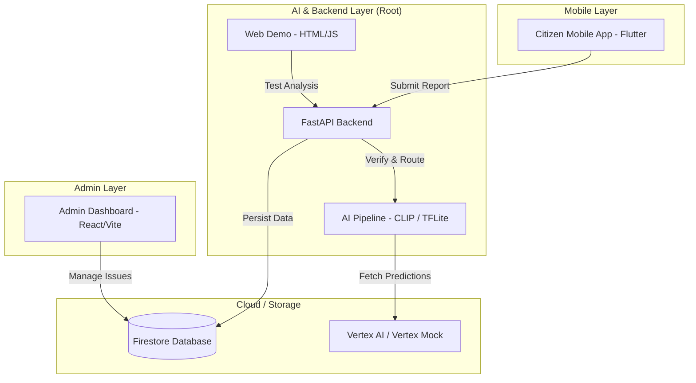

# Jansampark AI — Smart Civic Infrastructure 🏛️🤖

A Python-first reference implementation for a mobile-ready civic issue AI pipeline. This project aims to empower citizens to report civic issues (like potholes, garbage, or broken streetlights) and help administrators manage them efficiently using AI-driven verification and routing.

---

## 🏗️ Project Architecture



---

## 🚀 Quick Start for "Simple Users"

If you just want to see the AI analysis in action without setting up mobile apps or dashboards:

1.  **Open Project**: Ensure you have Python installed.
2.  **Run the Demo**: Open a terminal in the project root and run:
    ```bash
    python run_local_api.py
    ```
    *(The script will automatically find the project's virtual environment and start the server.)*
3.  **Open Browser**: Go to [http://127.0.0.1:8000](http://127.0.0.1:8000).
4.  **Test It**: Drag and drop an image (e.g., a photo of a pothole) and watch the Jansampark AI pipeline analyze it in real-time!

---

## 🛠️ Developer Setup

This repository contains three independent projects working together.

### 1. AI Backend & Pipeline (Root)
The core Python service handling image authentication, deduplication, and classification.

- **Technology**: FastAPI, PyTorch (CLIP), TensorFlow Lite.
- **Setup**:
  ```bash
  # Creation of virtual environment is recommended
  python -m venv venv
  .\venv\Scripts\activate  # Windows
  pip install -r requirements.txt
  python run_local_api.py
  ```
- **Key Files**:
  - `jansampark_ai/`: Core logic and model utilities.
  - `run_local_api.py`: Main entry point.
  - `configs/`: YAML configurations for models and routing.

### 2. Admin Dashboard (`/smart-civic-system-ak6/smart-civic-admin`)
A modern interface for administrators to monitor live reports and assign tasks to departments.

- **Technology**: React, Vite, Tailwind CSS, Firebase.
- **Setup**:
  ```bash
  cd smart-civic-system-ak6/smart-civic-admin
  npm install
  npm run dev
  ```
- **Direct Link**: [Admin Setup Details](file:///smart-civic-system-ak6/smart-civic-admin/README.md)

### 3. Citizen Mobile App (`/smart-civic-system-ak6/citizen_app`)
The mobile application for citizens to capture images and report issues.

- **Technology**: Flutter (Dart).
- **Setup**:
  ```bash
  cd smart-civic-system-ak6/citizen_app
  flutter pub get
  flutter run
  ```

---

## 🧠 AI Pipeline Details

The pipeline includes several specialized modules:

- **`jansampark_ai/training/`**: Training scripts for custom detectors and classifiers.
- **`jansampark_ai/validation/`**: Image authenticity checks (EXIF, dHash, and duplicate detection).
- **`jansampark_ai/routing/`**: Automatic department routing using Firestore.
- **`mobile_reference/`**: Flutter reference services for on-device `tflite_flutter` integration.

> [!TIP]
> **Zero-Shot Inference**: By default, the local API uses OpenAI's CLIP (via Transformers) to provide high-accuracy predictions without needing custom-trained weights for the initial demo.

---

## 📝 Configuration & Notes

- **Firebase**: Both the Backend and Admin panel require Firebase Firestore. Mock clients are used for basic local testing, but production requires a valid `serviceAccountKey.json`.
- **Ultralytics & TensorFlow**: Imports are lazy-loaded to ensure the backend can run in lightweight environments without GPU support.

---

## 📄 License
Python-first reference implementation used by Jansampark. All rights reserved.
